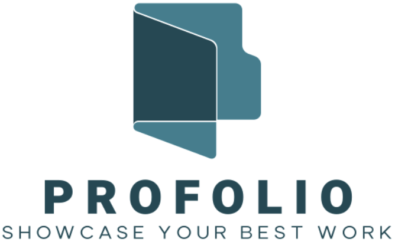

<h1 align="center">
  <br>
  
  <br>
  PRO-Folio
  <br>
</h1>

<h4 align="center">Professional Portfolio Creator</h4>
<div align="center">

</div>

</p>

<p align="center">
  <a href="#key-features">Key Features</a> •
  <a href="#how-to-use">How To Use</a> •
  <a href="#credits">Credits</a>
</p>

<!-- TODO: record gif with Gifox -->


## Key Features

- 💼 <em>Create custom PORTFOLIOS in seconds</em>; as easy as writing an email‼️🤯
- 🔄 Activate/De-active Portfolios to only share relevant portfolios.
- 📧 Direct email contact through active portfolios with whomever you share portfolio with - (recruiters can email you directly!).

## How To Use

> **Note:**
> The app does require an .env.local file at root of project with an email and app password to contact portfolio owners through their portfolios.

From your command line:

```bash
# Clone this repository
$ git clone https://github.com/1Dedios/pro-folio-creator

# Go into the repository
$ cd pro-folio-creator

# Install dependencies
$ npm install

# Run the app
$ npm start
```

> **Note**
> The commands above in Bash, are assuming a UNIX-like environment.

## Credits

This software was created by:

- K Berry
- D Shoenfelt
- E Padilla
- P Kartik
- A Kritta

This software uses the following open source packages:

- [Quill.js](https://quilljs.com/)
- [Bcrypt](https://github.com/kelektiv/node.bcrypt.js#readme)
- [Node.js](https://nodejs.org/)
- [Nodemailer](https://nodemailer.com/)
- [Express.js](https://expressjs.com/)
- [Express-Session](https://expressjs.com/en/resources/middleware/session.html)
- [Express Handlebars](https://github.com/express-handlebars/express-handlebars)

---
